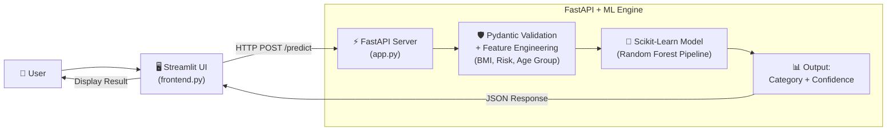

# 🛡️ Insurance Premium Prediction System

An end-to-end Machine Learning web application that predicts an applicant's **Insurance Premium Category** (`Low`, `Medium`, or `High`) based on their health indicators, lifestyle habits, and demographic details.

[](https://www.python.org/)
[](https://fastapi.tiangolo.com/)
[](https://streamlit.io/)
[](https://scikit-learn.org/)
[](https://www.docker.com/)

---

## 🧭 How It Works (Workflow Diagram)



---

## 🔍 Core Components Explained

### 1. 🧠 Machine Learning Model
- **Algorithm**: `RandomForestClassifier` bundled inside an Scikit-Learn `Pipeline` with a `ColumnTransformer`.
- **Target Classes**: Predicts premium risk category — `Low`, `Medium`, or `High`.
- **Feature Engineering**: When the user provides basic inputs (age, weight, height, smoking status, city, income, occupation), the system automatically calculates:
  - **BMI**: $\frac{\text{weight}}{\text{height}^2}$
  - **Lifestyle Risk**: Evaluated from BMI and smoking status (`high`, `medium`, `low`).
  - **Age Group**: Categorized into `young`, `adult`, `middle_aged`, or `senior`.
  - **City Tier**: Resolved from city databases into Tier 1, 2, or 3.
- **Output**: Returns the winning category, confidence score, and probability breakdown for each class.

---

### 2. ⚡ FastAPI Backend
- **High Performance**: Asynchronous Python API running on `uvicorn`.
- **Automatic Validation**: Uses **Pydantic** (`schema/user_input.py`) to validate ranges (e.g., age between 1-120, positive income) and formats before running the model.
- **Built-in Interactive Docs**:
  - Swagger UI: `http://localhost:8000/docs`
  - ReDoc: `http://localhost:8000/redoc`
- **Key Endpoints**:
  - `GET /` — API health status & welcome message.
  - `GET /health` — Simple health check probe.
  - `POST /predict` — Receives applicant details, runs model inference, returns predictions.

---

### 3. 🐳 Why We Use Docker
- **No Version Conflicts**: Machine Learning models (`model.pkl`) are sensitive to library versions. If your system runs a different version of `scikit-learn` or `Python`, the model can fail to load. Docker guarantees the exact runtime (`Python 3.11-slim` and `scikit-learn 1.6.1`).
- **"Works on Any Machine"**: Eliminates setup issues across Windows, Mac, and Linux. Anyone can run this API with a single command without installing Python dependencies.
- **Production Ready**: Containers can easily be deployed to AWS, Google Cloud Run, Azure, or Kubernetes.

---

### 4. 🖥️ Streamlit Frontend
- A clean, interactive web dashboard (`frontend.py`) for non-technical users.
- Users enter their details via sliders and dropdowns, click **Predict**, and instantly see their insurance premium risk category.

---

## 📁 Project Structure

```plaintext
Insurance_Premium_prediction/
├── app.py                 # FastAPI backend server
├── frontend.py            # Streamlit web UI
├── Dockerfile             # Docker container configuration
├── requirements.txt       # Project dependencies
│
├── ML_model/
│   ├── model.pkl          # Trained Random Forest pipeline
│   └── predict.py         # Model loading and inference function
│
├── schema/
│   ├── user_input.py      # Input validation & feature engineering
│   └── prediction_response.py # Output schema
│
└── config/
    └── city_tier.py       # City categorization list
```

---

## 🚀 Quick Start Guide

### Option A: Run with Docker (Recommended)

1. **Build the Docker image:**
   ```bash
   docker build -t insurance-api .
   ```

2. **Run the container:**
   ```bash
   docker run -p 8000:8000 --name insurance-container insurance-api
   ```

3. Open your browser and go to `http://localhost:8000/docs` to test the API!

---

### Option B: Run Locally

1. **Activate your virtual environment and install dependencies:**
   ```bash
   pip install -r requirements.txt
   ```

2. **Start the FastAPI backend:**
   ```bash
   uvicorn app:app --reload --port 8000
   ```

3. **In a new terminal, launch the Streamlit frontend:**
   ```bash
   streamlit run frontend.py
   ```
   The UI will open at `http://localhost:8501`.

---

## 📡 API Example

### Request (`POST /predict`):
```bash
curl -X POST "http://localhost:8000/predict" \
     -H "Content-Type: application/json" \
     -d '{
       "age": 35,
       "weight": 72.5,
       "height": 1.75,
       "income_lpa": 12.0,
       "smoker": false,
       "city": "Mumbai",
       "occupation": "private_job"
     }'
```

### Response:
```json
{
  "predicted_category": "Low",
  "confidence": 0.78,
  "class_probabilities": {
    "High": 0.01,
    "Low": 0.78,
    "Medium": 0.21
  }
}
```

---

## 👤 Author
- **Author**: Arjit Katiyar
